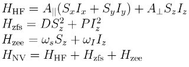

# NV-Centre ESR Simulation

## About

Simulates an electron spin resonance (ESR) experiment on an NV-center. The repository
contain both a Mathematica and a MATLAB version of the code. The former solves the
quantum master equation numerically. The latter removes the time-dependence of
the Hamiltonian using a rotating-wave approximation, and solves the system using
a simple time-evolution operator.

The Mathematica code is more fully featured and general, and the following section
will explain its function and usage.

## Mathematica codes

### How the simulation works

The time-evolution equation of a density matrix in the Schrödinger picture is

which is the *von Neumann equation*. By adding a dephasing term, we get get a quantum master equation. The system under consideration is the ground-state of the NV-center (Nitrogen-15), which can be considered as two interacting spin-1 particles. The Hamiltonian for the system is the ground-state of the NV-center:

The simulation supports any kind of Hamiltonian, and isn't necessarily restricted to HNV. For example, we could also consider a more complicated system consisting of the NV-center interacting with a set of other spins. We add a perturbing term to the Hamiltonian, an oscillating magnetic field (EM-wave) on an axis perpendicular to the principle axis of the ground-state

where the phase *&#981;* is a simulation parameter, and the frequency *f* is varied across a frequency-band. The total Hamiltonian is then

The goal of the simulation is to produce a plot of the response of the system to a perturbation with frequency *f*. For a system starting from a electron triplet-0 state *T0*, we'd expect a dip in the probability of the system inhabiting the *T0* after the perturbation, for a for a frequency *f* corresponding to appropriate energies. The simulation sweeps through frequencies between a starting frequency *freqStart* and *freqEnd* (with a specified resolution *freqStep*). For each frequency *f*, the simulation evolves an initial state *&#961;(0)* from a starting time *tStart* to an ending time *tEnd*. We then calculate the time-average for the system to inhabit each state *&#124; ms, mi &#10217;*

The following graph shows a result of one of these simulations.

Where the vertical axis is the time-averaged probability, and the horizontal axis the frequency of the perturbation. Taking the partial trace of the system, only considering the electron-triplet, we can plot P(T1), P(T0) and P(T-1):

### Usage manual

Since Mathematica notebooks work in a cell-format, the simulation is split up into compartmentalized sections. The first section NV-Centre ESR Simulation contains the main code and functionality of the simulation. Before starting any simulation, you should first initialize it by executing this section (click on the rightmost collapsible bracket of the section, and then press Shift+Enter).

Consult the *NV-Centre ESR Simulation &#8594; Functions* subsection for the documentation on how to use each function.

The subsequent section is *Simulations*, consisting of individual instances of the simulation, each with different parameters. *No spin-bath* runs the simulation on an isolated NV-center. The *Truncated Hamiltonian (ms= 0, +1) (No spin-bath)* runs the simulation on an isolated NV-center with a truncated Hamiltonian, only consider the *ms= 0, +1* states. The parameters of a simulation is set in the *Initialisation* subsection. You can tweak the simulation frequency-band, the frequency-resolution, the Hamiltonian, and everything else in there.

The *Save simulation data* subsection of a simulation saves the results into a folder called *results* in the notebook directory (if this directory doesn't already exist, you need to create it). All simulation data is stored into separate folders, containing multiple files. To load the results of a previous simulation into the notebook, you can use the *LoadSimulationData* function.

To run a simulation, simply selection the whole section, and press *Shift+Enter*. Note that it's not advised to run *Evaluate Notebook*, as this would evaluate *all* simulations.

To create a new simulation, simply copy one of the pre-made simulations and use it as a template.

## Acknowledgements

Special thanks to:

- Prof Dohun Kim - Integrated Quantum Systems Lab, Seoul National University
- Ji-Won Yun -  Integrated Quantum Systems Lab, Seoul National University
